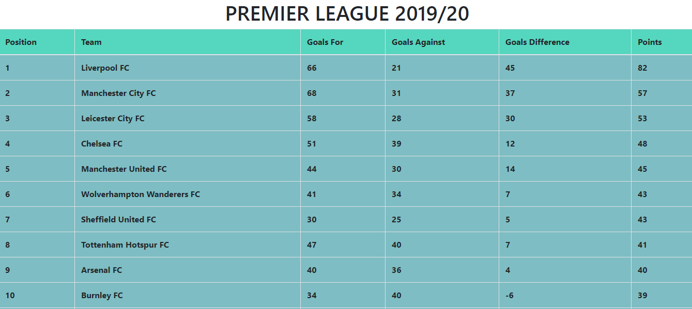

# Premier League Table 2019/20

Displaying the Premier League Table for 2019/20 season. 

The data API has been provided by https://www.football-data.org/ . 

# Instruction for Implementation

This repo contains everything except the config file and API Key. You can obtain the API Key after you register as a user on
https://www.football-data.org/. Go through their documentation for further details on the implementation of the API.

## Format for config file

let config = {
    API_KEY : YOUR_API_KEY
}
  
# Screeshot

